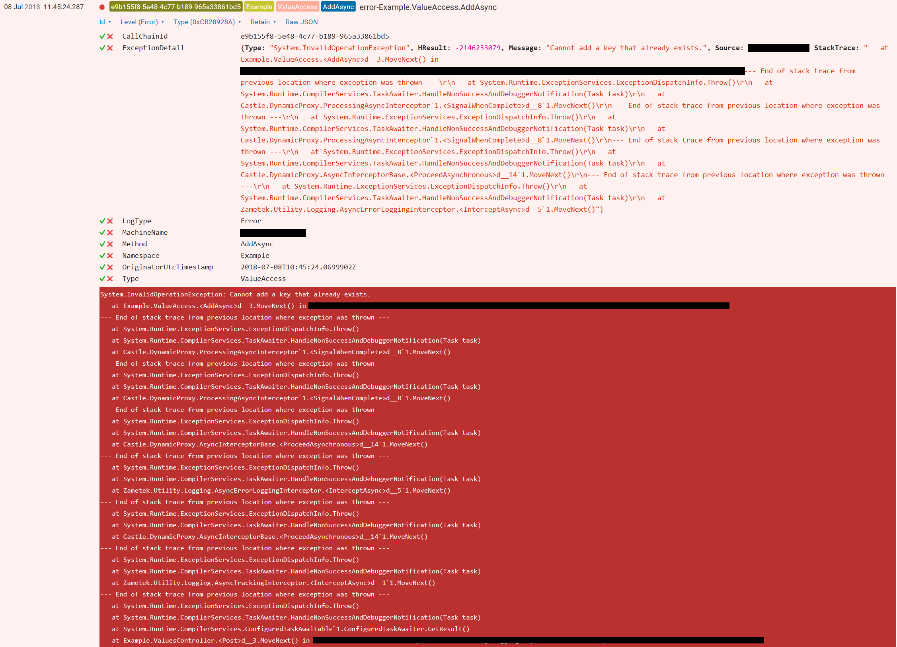

# Zametek.Logging

[](https://www.nuget.org/packages/Zametek.Utility.Logging.Primitives "NuGet Version") **Zametek.Utility.Logging**

[](https://www.nuget.org/packages/Zametek.Utility.Logging "NuGet Version") **Zametek.Utility.Logging**

[](https://www.nuget.org/packages/Zametek.Utility.Logging.AspNetCore "NuGet Version") **Zametek.Utility.Logging.AspNetCore**

## Overview

**Zametek.Utility.Logging** is a simple DotNet utility framework designed to provide rich, contextual logging for classes that are used as injected dependencies.

That is to say, if you use [Dependency Injection](https://en.wikipedia.org/wiki/Dependency_injection), and are following the D in [SOLID](https://en.wikipedia.org/wiki/SOLID), you can use **Zametek.Utility.Logging** to enhance your logging capabilities with minimal code changes.

Out-of-the-box it provides automatic:

- Contextual call-chain tracking (including across `Tasks`)
- Error and Exception logging
- Method-call performance logging, and
- Detailed diagnostic logging at the class, method and parameter level

## The way it works

The key component is the `LogProxy` class, which uses static `Create()` methods to wrap a class instance in a number of interceptor layers and then creates an interface-derived logging proxy using [Castle DynamicProxy](https://www.castleproject.org/projects/dynamicproxy/). Each of the interceptor layers provides a separate and distinct logging capability, which can be included or excluded as necessary.

**Zametek.Utility.Logging** comes with **four** built-in interceptors:

- `AsyncTrackingInterceptor`
- `AsyncErrorLoggingInterceptor`
- `AsyncPerformanceLoggingInterceptor`, and
- `AsyncDiagnosticLoggingInterceptor`

Each is built using the excellent [Castle.Core.AsyncInterceptor](https://github.com/JSkimming/Castle.Core.AsyncInterceptor).

If you need to create custom logging capabilities, then `LogProxy.Create()` can also accept custom interceptors that derive from [`DynamicProxy.IInterceptor`](https://github.com/castleproject/Core/blob/master/src/Castle.Core/DynamicProxy/IInterceptor.cs).

## Key Dependencies

### Serilog

At the moment, **Zametek.Utility.Logging** only works with [Serilog](https://github.com/serilog/serilog) because of its support for structured logging. This may change in the future, but for now it is a pre-requisite.

## Standard Interceptors

### Tracking

The `AsyncTrackingInterceptor` creates a new static [`TrackingContext`](https://github.com/countincognito/Zametek.Utility/blob/master/src/Zametek.Utility/TrackingContext.cs) (from [Zametek.Utility](https://github.com/countincognito/Zametek.Utility)) at the top of the call-chain, if (and only if) one does not already exist.

It is included in the `LogProxy.Create()` call by default.

Using `TrackingContext` provides several immutable, out-of-band properties:

- A `Guid` value called `CallChainId`, which provides a unique identifier for tracking the logical flow of the call-chain through the code (including across `Tasks`)
- A `DateTime` value called `OriginatorUtcTimestamp`, which provides a UTC timestamp for when the `TrackingContext` (and hence the call-chain) was initiated
- A `IReadOnlyDictionary<string, string>` value called `ExtraHeaders`, which allows the initialisation code to add custom key-value `string` pairs to the `TrackingContext`

By default, the `AsyncTrackingInterceptor` will populate the `CallChainId` and the `OriginatorUtcTimestamp` properties, but leave `ExtraHeaders` empty. Since all the properties in `TrackingContext` are immutable, in order to add custom key-value `string` pairs to the `ExtraHeaders` property, you will either have to:

- Create a new static `TrackingContext` instance before the `AsyncTrackingInterceptor` is called, or
- Replace the existing static `TrackingContext` instance with a new one

Both of these options are perfectly acceptable.

For example:

```csharp
// Initialise some new header key-value pairs.
var newHeaders = new Dictionary<string, string>();
newHeaders.Add("Jurisdiction", "UK");
newHeaders.Add("TimeZone", "GMT");

// Check the current static TrackingContext.
TrackingContext trackingContext = TrackingContext.Current;

if (trackingContext == null)
{
    // If there is no existing static TrackingContext, then create one.
    var newTrackingContext = new TrackingContext(
        Guid.NewGuid(),
        DateTime.UtcNow,
        newHeaders);

    // Set the new TrackingContext as Current.
    newTrackingContext.SetAsCurrent();
}
else
{
    // If there is pre-existing static TrackingContext, then replace it.

    // Be sure to copy over the old key-value pairs, if any exist.
    IReadOnlyCollection<KeyValuePair<string, string>> extraHeaders = trackingContext.ExtraHeaders;

    if (extraHeaders != null)
    {
        foreach (KeyValuePair<string, string> kvp in extraHeaders)
        {
            if (!newHeaders.ContainsKey(kvp.Key))
            {
                newHeaders.Add(kvp.Key, kvp.Value);
            }
        }
    }

    // To keep new logs consistent with old logs, copy the old immutable properties.
    var newTrackingContext = new TrackingContext(
        trackingContext.CallChainId,
        trackingContext.OriginatorUtcTimestamp,
        newHeaders);

    // Set the new TrackingContext as Current.
    newTrackingContext.SetAsCurrent();
}
```

**Please note**: excluding this interceptor from `LogProxy.Create()` will _not_ prevent a static `TrackingContext` from being created, nor will it remove a pre-existing `TrackingContext`. This interceptor simply guarantees that a `TrackingContext` will always be present once a logging proxy is called.

The `TrackingContext` is also serializable so it can be propagated across network calls. This is demonstrated in the examples listed in the **Samples** section below.

### Errors and Exceptions

The `AsyncErrorLoggingInterceptor` uses [Serilog.Exceptions](https://github.com/RehanSaeed/Serilog.Exceptions) to extract more meaningful message details whenever an exception occurs within a logging proxy method call. It also records the namespace, class type, and method name of that particular call.

It is included in the `LogProxy.Create()` call by default.

### Performance

The `AsyncPerformanceLoggingInterceptor` simply uses the [`AsyncTimingInterceptor`](https://github.com/JSkimming/Castle.Core.AsyncInterceptor/blob/master/src/Castle.Core.AsyncInterceptor/AsyncTimingInterceptor.cs) to record how long (in milliseconds) it takes for a logging proxy method call to return.

It is included in the `LogProxy.Create()` call by default.

### Diagnostic

The `AsyncDiagnosticLoggingInterceptor` is an interceptor capable of logging the contents of **all** input parameters and return values for every method call made on a logging proxy. This capability can be turned 'on' or 'off' at the class, method or parameter level when the interceptor is included, or disabled completely if the interceptor is excluded.

**Important**: since input parameters and return values can often contain sensitive information that you may not wish to persist in your logging output, this interceptor should be used carefully and with caution. As such, it is **not** included in the `LogProxy.Create()` call by default.

There are several ways to ensure that sensitive data are automatically excluded or filtered out of diagnostic logging.

#### DiagnosticLoggingAttribute

The `AsyncDiagnosticLoggingInterceptor` logs data on an explicit 'on'/'off' model; the default setting is always 'off', even when the interceptor is activated.

The 'on'/'off' model is configured according to a nested hierarchy:

- **Classes** are the top level of the hierarchy, they are also the parents of **methods**, and grandparents of **input parameters** and **return values**
  - If a class turns diagnostic logging 'on' or 'off', then diagnostic logging will be turned 'on' or 'off' for all of its descendents too
  - However, each individual descendent can explicitly turn diagnostic logging 'on' or 'off' if it chooses
- **Methods** are the children of **classes**, and the parents of **input parameters** and **return values**
  - A method can have diagnostic logging turned 'on' or 'off' either explicitly or by virtue of its parent class doing the same
  - If a method has diagnostic logging turned 'on' or 'off', then diagnostic logging will be turned 'on' or 'off' for all of its descendents too
  - However, each individual descendent can explicitly turn diagnostic logging 'on' or 'off' if it chooses
- **Input parameters** and **return values** are the children of **methods**, and the grandchildren of **classes**
  - An input parameter or return value can have diagnostic logging turned 'on' or 'off' either explicitly or by virtue of its parent method doing the same

This model is configured by applying the `DiagnosticLoggingAttribute` at different levels in the nested hierarchy.

For example:

```csharp
namespace Example
{
    // This instructs the AsyncDiagnosticLoggingInterceptor to log the input parameters
    // and return values on all methods within this class.
    // The default is [DiagnosticLogging(LogActive.Off)].
    [DiagnosticLogging(LogActive.On)]
    public class DemoService
        : IDemoService
    {
        // Both the input parameters and the void return will be logged on this method
        // since the parent class has diagnostic logging turned on.
        // The return value will be listed as the special value __VOID__.
        public void ThisReturnsVoid(string param1, string param2)
        {
        }

        // However, nothing will be logged on this method as it is explicitly turning
        // diagnostic logging off for the itself and its children, which overrides its
        // parent's setting.
        [DiagnosticLogging(LogActive.Off)]
        public void ThisAlsoReturnsVoid(string param1, string param2)
        {
        }

        // This method has diagnostic logging turned on (thanks to its parent class).
        // However, only the void return and one input parameter (param2) will be logged
        // because param1 is explicitly turning diagnostic logging off, which overrides
        // its parent's setting.
        // The return value will be listed as the special value __VOID__.
        public void ThisAlsoAsoReturnsVoid(
            [DiagnosticLogging(LogActive.Off)] string param1,
            string param2)
        {
        }

        // This method has diagnostic logging explicitly turned off, so none of its
        // children should be logged.
        // However, the return value _will_ be logged because it is explicitly turning
        // diagnostic logging on, which overrides its parent's setting.
        [DiagnosticLogging(LogActive.Off)]
        [return: DiagnosticLogging(LogActive.On)]
        public string ThisReturnsAString(string param1, string param2)
        {
            return @"A string";
        }

        // This method has diagnostic logging explicitly turned off. However, all of its
        // children are individually turning diagnostic logging on, which overrides their
        // parent's setting.
        // This is functionally equivalent to putting [DiagnosticLogging(LogActive.On)]
        // on the whole method, or just leaving it blank in this case since the parent
        // class already has diagnostic logging turned on.
        [DiagnosticLogging(LogActive.Off)]
        [return: DiagnosticLogging(LogActive.On)]
        public string ThisAlsoReturnsAString(
            [DiagnosticLogging(LogActive.On)] string param1,
            [DiagnosticLogging(LogActive.On)] string param2)
        {
            return @"Another string";
        }
    }
}
```

#### Destructurama

The `AsyncDiagnosticLoggingInterceptor` leverages [Serilog's ability to destructure objects](https://nblumhardt.com/2016/02/serilog-tip-dont-serialize-arbitrary-objects/) during logging. However, this _does_ mean that sensitive data buried in the individual fields of a DTO _could_ get logged when they really should not be.

One way around this is to use `[DiagnosticLogging(LogActive.Off)]` on any DTO input parameters or return values that may contain sensitive data, but that would mean ignoring everything else in the DTO that could be safely logged. Ideally there would be a better way.

Thankfully, [there are some elegant solutions to this already](https://nblumhardt.com/2014/07/using-attributes-to-control-destructuring-in-serilog/): simply use the [Destructurama.Attributed](https://github.com/destructurama/attributed) and/or the [Destructurama.ByIgnoring](https://github.com/destructurama/by-ignoring) libraries.

For an example of how to do this, see the **Usage** section below.

#### FilterTheseParameters

Finally, there is the static `HashSet<string>` on `LogProxy` called `FilterTheseParameters`. If the name of an input parameter exactly matches one of the items in this collection, then it will be automatically filtered out of diagnostic logging.

This collection can be edited at runtime, but it is best to do so before any logging proxies are created.

The default values of this collection are: "password", "PASSWORD", "Password", "secret", "SECRET", "Secret".

## Example

### Usage

As a basic example, let us take an ordinary service class called `ValueAccess`, which implements an interface called `IValueAccess` and uses custom DTOs `RequestDto` and `ResponseDto` in its input parameters and return values.

First we define the request DTO:

```csharp
using Destructurama.Attributed;
using System;

namespace Example
{
    [Serializable]
    public class RequestDto
    {
        public string Name { get; set; }

        // This ensures that this property is ignored by Serilog
        // during destructuring.
        [NotLogged]
        public string Email { get; set; }
    }
}
```

Next we define the response DTO:

```csharp
using System;

namespace Example
{
    [Serializable]
    public class ResponseDto
    {
        public string Name { get; set; }

        // Instead of using Destructurama.Attributed, we can instruct
        // Serilog to ignore this property in code by using
        // Destructurama.ByIgnoring in the Logger configuration.
        // See below.
        public string Email { get; set; }

        public string Password { get; set; }
    }
}
```

The service contract/interface is also very simple:

```csharp
using System.Collections.Generic;
using System.Threading.Tasks;

namespace Example
{
    public interface IValueAccess
    {
        Task<string> AddAsync(RequestDto requestDto, string password);
        Task<IList<ResponseDto>> GetAllAsync();
    }
}
```

The service implementation is slightly more verbose:

```csharp
using Serilog;
using System;
using System.Collections.Generic;
using System.Linq;
using System.Threading.Tasks;
using Zametek.Utility.Logging;

namespace Example
{
    [DiagnosticLogging(LogActive.On)]
    public class ValueAccess
        : IValueAccess
    {
        private IDictionary<string, ResponseDto> m_Cache;
        private ILogger m_Logger;

        // Here we pass in the same logger that is used in the creation
        // of the logging proxy.
        public ValueAccess(ILogger logger)
        {
            m_Logger = logger ?? throw new ArgumentNullException(nameof(logger));
            m_Cache = new Dictionary<string, ResponseDto>();
        }

        // The return value will not be logged and neither will the password
        // string (since it is included in FilterTheseParameters).
        // The Email property in RequestDto will also be ignored by Serilog
        // thanks to the NotLoggedAttribute in the class definition.
        [return: DiagnosticLogging(LogActive.Off)]
        public async Task<string> AddAsync(RequestDto requestDto, string password)
        {
            m_Logger.Information($"{nameof(AddAsync)} Invoked");
            m_Logger.Information($"{nameof(AddAsync)} {requestDto.Name}");

            var response = new ResponseDto
            {
                Name = requestDto.Name,
                Email = requestDto.Email,
                Password = password,
            };

            if (!m_Cache.TryAdd(requestDto.Name, response))
            {
                throw new InvalidOperationException("Cannot add a key that already exists.");
            }

            await Task.Yield();

            return response.Name;
        }

        // Everything will be logged from this method. However, the Email
        // and Password properties will be ignored by Serilog thanks to the
        // Destructure.ByIgnoringProperties extension in the Logger configuration.
        public async Task<IList<ResponseDto>> GetAllAsync()
        {
            m_Logger.Information($"{nameof(GetAllAsync)} Invoked");

            await Task.Yield();

            return m_Cache.Values.ToList();
        }
    }
}
```

When creating the logging proxy, we need to ensure the Logger is configured correctly:

```csharp
ILogger serilog = new LoggerConfiguration()
    // Use FromLoggingProxy to activate Serilog enrichment.
    .Enrich.FromLogProxy()
    // This ensures that properties decorated using
    // Destructurama.Attributed are taken into account.
    .Destructure.UsingAttributes()
    // This achieves the same as the previous line except
    // using code rather than Attributes.
    .Destructure.ByIgnoringProperties<ResponseDto>(x => x.Email, x => x.Password)
    // This writes the output to a local Seq instance, but
    // you can choose where to send it.
    .WriteTo.Seq("http://localhost:5341")
    .CreateLogger();

// Always best practice to set the static Logger.
Log.Logger = serilog;

IValueAccess valueAccess = new ValueAccess(serilog);

// This is functionally equivalent to LogType.All
LogType logTypes = LogType.Tracking | LogType.Error | LogType.Performance | LogType.Diagnostic;

// Wrapping a class in a LogProxy automatically enriches the serilog output.
var valueAccess = LogProxy.Create<IValueAccess>(valueAccess, serilog, logTypes);

var requestDto = new RequestDto() { Name = @"Ben", Email = @"ben@example.org" };

// The following calls will generate an enriched output in Seq.
string name = await valueAccess.AddAsync(requestDto, @"Password123!");

serilog.Information($"{name} added");

IList<ResponseDto> responseDtos = await valueAccess.GetAllAsync();

// If we run the request again with the same DTO it should generate
// and exception!
await valueAccess.AddAsync(requestDto, @"Password123!");
```

### Log Outputs

The log outputs when calling `AddAsync` from the above example would look similar to the following:


The log outputs when calling `GetAllAsync` from the above example would look similar to the following:


The following fields have been added to the log enrichment where necessary:

- `LogType`: using the default interceptors, this value can be either:
  - `Performance`
  - `Error`, or
  - `Diagnostic`
- `Namespace`: this provides the namespace of the parent class from where the logging proxy method call was initiated
- `Type`: this provides the type name of the parent class from where the logging proxy method call was initiated
- `Method`: this provides the name of the logging proxy method call itself
- `CallChainId`: this is added by the `AsyncTrackingInterceptor` and provides a unique (`Guid`) value that traces all the way through the logical call-chain (including across `Tasks`)
- `OriginatorUtcTimestamp`: this is added by the `AsyncTrackingInterceptor` and provides a UTC timestamp for when the `TrackingContext` (and hence the call-chain) was initiated
- `ElapsedMilliseconds`: this is added by the `AsyncPerformanceLoggingInterceptor` and provides the number of milliseconds it takes for a logging proxy method call to return
- `Arguments`: this is added by the `AsyncDiagnosticLoggingInterceptor` and shows a break down of the input parameters that are used in a logging proxy method call. Note the following:
  - Using the **Destructurama** extensions for **Serilog** will automatically exclude specific named properties from destructured objects (such as the `Email` property in`RequestDto`)
  - The special value `__FILTERED__` will be used when an input parameter is marked as 'off' (either implicitly or explicitly), or when it appears in the `FilterTheseParameters`collection (such as the `Password` input parameter in the `AddAsync` method)
- `ReturnValue`: this is added by the `AsyncDiagnosticLoggingInterceptor` and shows a break down of the return value that is returned from a logging proxy method call. Note the following:
  - As with the `Arguments` field, using the **Destructurama** extensions for **Serilog** will automatically exclude specific named properties from destructured objects (such as  the `Email` and `Password` properties in `ResponseDto`)
  - The special value `__FILTERED__` will be used when a return value is marked as 'off' (either implicitly or explicitly)
  - The special value `__VOID__` will be used when a method call has no return value

The log outputs when an exception is generated from the above example would look similar to the following:



The following fields have been added to the log enrichment where necessary:

- `ExceptionDetail`: this is added by the `AsyncErrorLoggingInterceptor` and provides more meaningful message details whenever an exception occurs within a logging proxy method call
  - The extraction of the message details is done using [Serilog.Exceptions](https://github.com/RehanSaeed/Serilog.Exceptions)

## Samples

For some working examples of `LogProxy` in action, either see the test project in [Zametek.Utility.Logging.AspNetCore.TestApi](test/Zametek.Utility.Logging.AspNetCore.TestApi), or see the following examples:

- [Company.ServiceFabric](https://github.com/countincognito/Company.ServiceFabric)
- [Company.Grpc](https://github.com/countincognito/Company.Grpc)

Both of the above include examples of how `TrackingContext` can be serialized and propagated across a network call.
